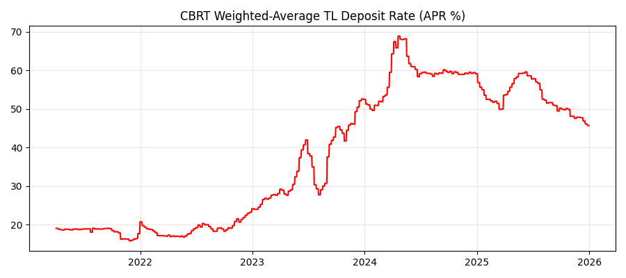
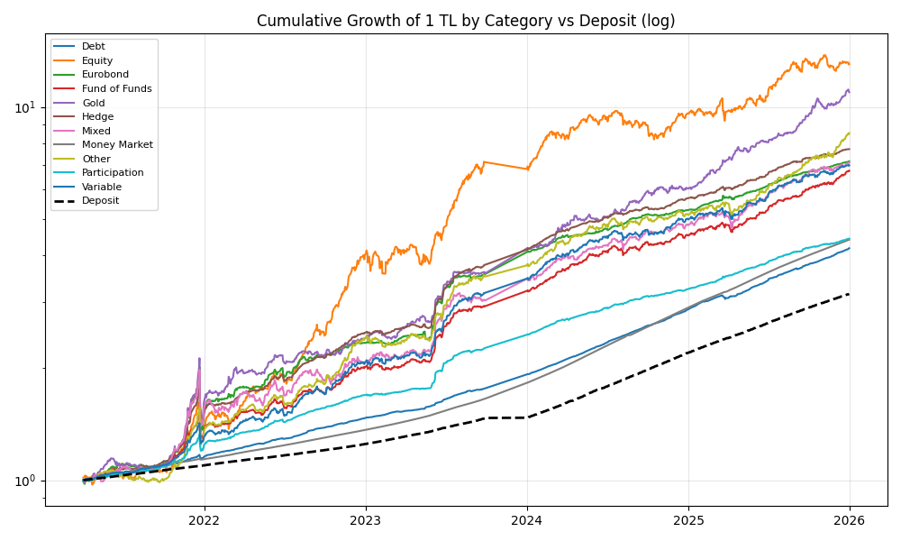
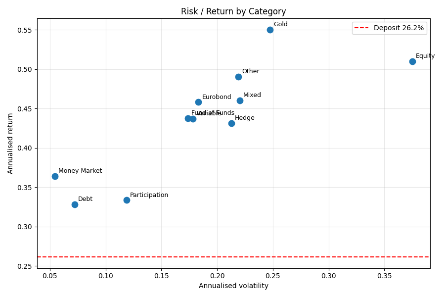
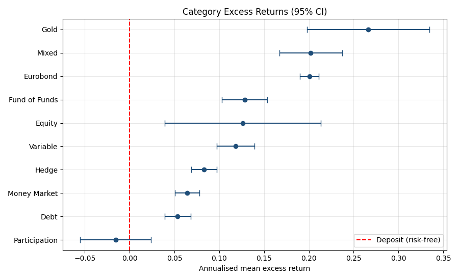
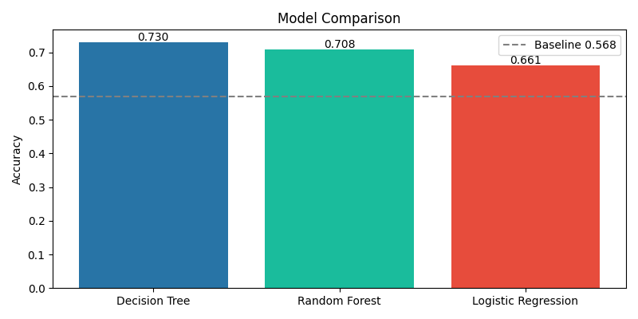
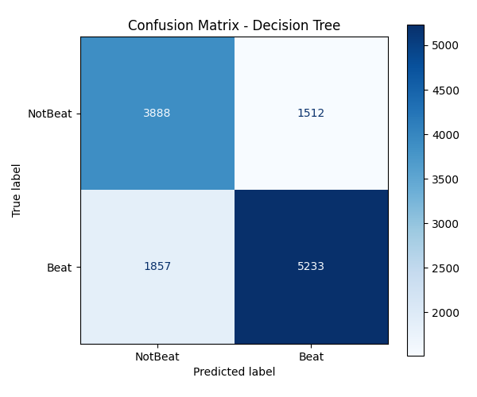
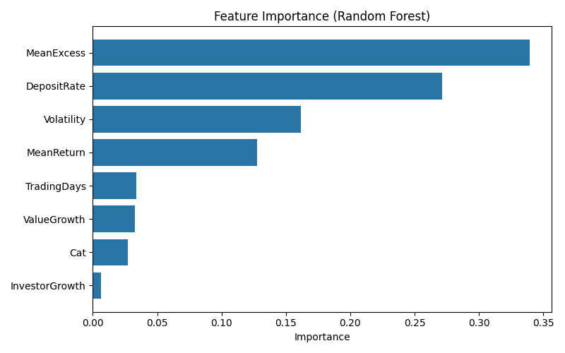

# DSA 210 - Term Project Final Report
## Performance Analysis of Turkish Investment Funds vs. Risk-Free Deposit Rates (2021-2025)
**Ulaş Alpandiner — 33831**

---

## Motivation

In Türkiye, especially between 2021 and 2025, inflation went through the roof and the central bank kept raising interest rates. At some point deposit rates hit almost 50%. This made me wonder: if you could just put your money in a bank account and earn that much, is there even a point in investing in funds?

Everyone around me was talking about gold funds, stock funds, "katılım" funds etc. but nobody really checked the numbers. So I wanted to answer a simple question: **which fund categories actually beat the bank deposit, and which ones are just hype?**

This project looks at all TEFAS funds over 5 years and compares each category against the CBRT deposit rate to see which ones actually delivered.

---

## Data Source

I used two datasets:

**1. TEFAS Fund Data**
- Source: TEFAS (Türkiye Elektronik Fon Alım Satım Platformu)
- 1,354,763 daily observations across 2,006 funds
- Period: April 2021 – December 2025
- Fields: date, fund code, fund name, price, outstanding shares, investor count, total fund value

**2. CBRT Deposit Rates**
- Source: EVDS (Electronic Data Delivery System, Central Bank of Turkey)
- Series: TP.TRY.MT02 — weighted average TL deposit rate
- 262 weekly observations, April 2021 – April 2026
- This is my "risk-free rate" benchmark

The enrichment here is combining the fund performance data with the macroeconomic deposit rate data. I converted the weekly deposit rate to a daily rate (APR / 365) so I could calculate excess returns for each fund on each day.

---

## Data Analysis

### Categorisation

TEFAS doesn't give you a clean "category" field, so I classified each fund by looking for keywords in the fund name. For example, "HİSSE" → Equity, "ALTIN" → Gold, "SERBEST" → Hedge, etc.

### Daily Returns and Excess Returns

For each fund I calculated:
- **Daily return** = percentage change in price
- **Excess return** = daily return − daily deposit rate

If excess return is positive, the fund beat the bank that day.

### EDA

**Deposit rate over time (fig1):** The rate started around 19% in 2021, dropped briefly during the low-rate policy period, then shot up to almost 49% by early 2026.



**Cumulative growth (fig2):** If you put ₺1 into each category in April 2021, Gold funds grew the most. The black dashed line shows the deposit benchmark.



**Risk/return scatter (fig3):** This was the most interesting plot for me. Money Market funds sit in the bottom-left (low return, very low risk). When you adjust for risk using the Sharpe ratio, Money Market is actually the best, which surprised me.



**Annualised summary:**

| Category | Ann. Return | Ann. Vol | Sharpe |
|---|---|---|---|
| Money Market | 36.4% | 5.5% | **1.87** |
| Gold | 55.0% | 24.7% | 1.17 |
| Eurobond | 45.8% | 18.3% | 1.07 |
| Fund of Funds | 43.8% | 17.4% | 1.01 |
| Variable | 43.7% | 17.8% | 0.98 |
| Debt | 32.8% | 7.2% | 0.92 |
| Mixed | 46.0% | 22.0% | 0.90 |
| Hedge | 43.2% | 21.3% | 0.80 |
| Equity | 51.0% | 37.5% | 0.66 |
| Participation | 33.3% | 11.9% | 0.61 |

Average deposit rate over the period ≈ 26.2% p.a.

### Hypothesis Testing

**Test 1: One-sample t-test (per category)**
- H₀: mean excess return = 0 (same as deposit)
- H₁: mean excess return ≠ 0

9 out of 10 categories rejected H₀. Only **Participation (Katılım) funds** failed to reject (p = 0.437).



**Test 2: Chi-square test of independence**
- H₀: Category and beating-the-deposit are independent
- H₁: They are dependent

| Category | Beat | NotBeat |
|---|---|---|
| Money Market | 119 | 1 |
| Gold | 55 | 5 |
| Fund of Funds | 75 | 11 |
| Debt | 64 | 10 |
| Variable | 118 | 28 |
| Hedge | 630 | 237 |
| Equity | 253 | 142 |
| Participation | 82 | 50 |

χ² = 97.93, df = 7, p ≈ 3 × 10⁻¹⁸ → **REJECT H₀**. Category and performance are strongly dependent.

Money Market has 119/1 — almost perfect. But Participation is 82/50, much closer to a coin flip.

---

## Machine Learning

Can we predict if a fund will beat the deposit rate next month?

### Features

For each fund in each month:
- MeanReturn, Volatility, MeanExcess
- DepositRate (current macro level)
- InvestorGrowth, ValueGrowth
- TradingDays, Category

**Target:** Did the fund beat the deposit *next* month? (62,450 monthly observations, 80/20 split)

### Results

| Model | Accuracy |
|---|---|
| Decision Tree | **73.0%** |
| Random Forest | 70.8% |
| Logistic Regression | 66.1% |
| Baseline (majority class) | 56.8% |

All three beat the baseline. Decision Tree was the best.





### Feature Importance



Most important: MeanExcess (34%), DepositRate (27%), Volatility (16%). Investor growth and value growth turned out to be almost irrelevant, which surprised me — I thought fund flows would be a good signal but price-based features dominate.

---

## Findings

1. **Most fund categories beat the deposit** over 2021-2025, but not all. Participation (Islamic) funds failed to beat it.
2. **Money Market is the risk-adjusted winner** (Sharpe 1.87). 119 out of 120 funds beat the deposit.
3. **Gold had the highest raw excess return** (~27% p.a. over deposit), driven by TL depreciation and global gold rally.
4. **Equity looks good on paper** (51% return) but has the highest volatility — its Sharpe is one of the lowest.
5. **Category choice matters** — chi-square confirms this (p ≈ 10⁻¹⁸).
6. **Next-month performance is partially predictable** — Decision Tree gets 73% accuracy vs 57% baseline. Strongest predictor is current month's excess return (momentum).

---

## Limitations and Future Work

**Limitations:**
- Category classification is based on fund names — rough but workable
- No management fees, taxes, or transaction costs included
- 2021-2025 Türkiye was an unusual macro period (high inflation, policy shifts)
- Survivorship bias in the data
- ML uses random split instead of time-based split

**Future work:**
- Time-series cross-validation for ML
- More features (inflation, USD/TRY, BIST index)
- More advanced models (XGBoost, etc.)
- Individual fund selection within categories

---

## Repository Structure

```
DSA210TermProject/
├── DataSet/
│   ├── EVDS_14-04-2026 (1).xlsx
│   └── TEFAS_Tum_Veriler_Raw.csv.zip
├── Milestone1/                          # Phase 2: EDA + Hypothesis Tests
│   ├── DSA210TermProject.ipynb
│   ├── DSA 210 Project Proposal.docx
│   ├── fig1_deposit_rate.png
│   ├── fig2_cumulative.png
│   ├── fig3_risk_return.png
│   ├── fig4_excess_ci.png
│   ├── summary.csv
│   ├── test1_ttest.csv
│   └── test2_contingency.csv
├── Milestone2/                          # Phase 3: Machine Learning
│   ├── DSA210TermProjectPhase3.ipynb
│   ├── fig5_model_comparison.png
│   ├── fig6_confusion_matrix.png
│   ├── fig7_feature_importance.png
│   └── feature_importance.csv
└── README.md
```

---

## How to Reproduce

```
pip install pandas numpy matplotlib scipy scikit-learn openpyxl
```

Unzip `TEFAS_Tum_Veriler_Raw.csv.zip` from `DataSet/`, put both data files in the same folder as the notebooks, and run them in order.

---

## AI Disclosure

Some code scaffolding and parts of this report were drafted with help from Claude (Anthropic). All analysis decisions, interpretations, and personal observations are my own.
